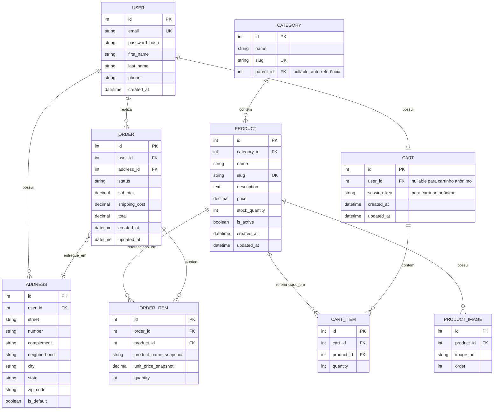

# Modelagem do Banco de Dados

## Diagrama ER (Mermaid)

## Descrição das entidades

### User
Usuário do sistema. Autenticação via e-mail/senha. Campos de senha nunca armazenam texto puro (hash via Django's `PBKDF2` por padrão).

### Address
Endereços de entrega vinculados a um usuário. Um usuário pode ter múltiplos endereços, com um marcado como padrão (`is_default`).

### Category
Categorias de produtos, com suporte a subcategorias via autorreferência (`parent_id`). Ex: "Eletrônicos" → "Celulares".

### Product
Produto do catálogo. `slug` é usado para URLs amigáveis (`/produtos/tenis-esportivo`). `stock_quantity` controla disponibilidade — deve ser decrementado ao confirmar um pedido.

### ProductImage
Permite múltiplas imagens por produto, com campo `order` para definir a ordem de exibição na galeria.

### Cart
Carrinho de compras. Pode pertencer a um usuário autenticado (`user_id`) ou a uma sessão anônima (`session_key`), permitindo que visitantes montem carrinho antes de logar.

### CartItem
Item individual dentro de um carrinho, referenciando um produto e a quantidade desejada.

### Order
Pedido finalizado. Guarda valores calculados (`subtotal`, `shipping_cost`, `total`) no momento da compra — não recalculados dinamicamente depois, para preservar histórico fiel mesmo se o preço do produto mudar no futuro.

**Valores sugeridos para `status`:**
`pending` → `paid` → `shipped` → `delivered` (+ `cancelled` como estado alternativo)

### OrderItem
Item de um pedido. Importante notar os campos `product_name_snapshot` e `unit_price_snapshot`: eles **congelam** o nome e preço do produto no momento da compra, para que o histórico do pedido não seja afetado se o produto for editado ou removido do catálogo depois.

## Índices recomendados

- `Product.slug` — único, usado em buscas por URL
- `Product.category_id` — para filtros por categoria
- `Order.user_id` — para consultar histórico de pedidos do usuário
- `CartItem(cart_id, product_id)` — único composto, evita duplicidade do mesmo produto no carrinho

## Decisões de modelagem

- **Snapshot de preço/nome no pedido**: essencial em e-commerce real — sem isso, editar um produto retroagiria no histórico de pedidos antigos, o que é incorreto.
- **Carrinho anônimo via `session_key`**: permite que o usuário monte o carrinho sem estar logado, migrando os itens para o `user_id` no momento do login.
- **Soft delete não incluído no MVP**: produtos removidos usam `is_active = False` ao invés de exclusão física, preservando integridade referencial com pedidos antigos.
